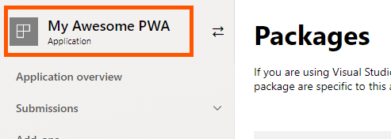
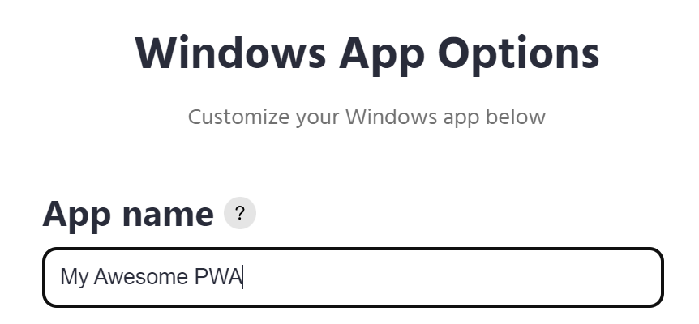

# PWABuilder Frequently Asked Questions

## **Windows Platform** 
### Where do I find my publisher information?
In order to publish your PWA in the Microsoft Store, you'll need 3 things:

1. `Package ID`
2. `Publisher ID`
3. `Publisher display name`

To get this information, go to [Windows Partner Center](https://partner.microsoft.com/dashboard) and click on your app. (Don't have an app yet? **[LINK TO CREATING A NEW PWA]**.)

Choose `Product Management` -> `Product Identity`:

You'll see the Package ID, Publisher ID, and publisher display name. You'll need all three of these to publish in the Store.

On PWABuilder when generating your Windows app, add these values to the Windows package options:

### "Invalid package publisher name"

This error indicates that you need to rebuild your PWA app package with the correct `publisher`. [How can I find my publisher ID?](**link to above**)

### "Invalid package identity name" / "Invalid package family name"

These two combined errors, `Invalid package identity name` and `Invalid package family name`, can be fixed by rebuilding your PWA app package on PWABuilder with the correct package ID.

 In the above error message, the expected package ID is `42541MyCompany.MyAwesomePwa` - go to PWABuilder and rebuild your package with the correct package ID:   

### "This package's manifest uses a display name that you have not reserved"

This means the app name you used when generating your app package on PWABuilder doesn't match the app name reserved in Partner Center.

The app name in Partner Center...

...must match the app name you used on PWABuilder:

## **Android Platform**
### Address Bar still shows
Here you can find up to date [instructions on adding your assetlinks.json to your repo](https://github.com/pwa-builder/CloudAPK/blob/master/Asset-links.md).

## **iOS Platform**
### How can I tell if my PWA was launched from the iOS app?
At runtime, your PWA will have a `app-platform` cookie. This cookie's value will be set to `iOS App Store`.

### Can I publish to the App Store without a Mac?

No, not currently. You'll need Xcode to build your project, which is only available on Mac.

In the meantime, there are 3rd party build services, such as [AppVeyor](https://www.appveyor.com/pricing/) or [GitHub Actions with Xcode Archive](https://github.com/marketplace/actions/xcode-archive), that can build Xcode projects as part of your continuous integration (CI) pipeline. 

Additionally, there are inexpesive services, such as [Macincloud](https://www.macincloud.com/), which let you remote into a Mac with Xcode already installed. You can use those services to build your PWA iOS app package.

### What PWA features can I use on iOS?

Unlike Google Play and Microsoft Store, Apple's App Store doesn't natively support PWAs.

To bridge this gap, your PWA runs in a [WKWebView](https://developer.apple.com/documentation/webkit/wkwebview) hosted inside a native Swift app. Generally, features that work in iOS Safari will work in your PWA.

This includes [service worker support](https://love2dev.com/blog/apple-ships-service-workers/), shortcuts, theme_color, background_color, and more.

Our PWA template currently does not support some PWA features like push notifications.

We'd be glad to accept PRs to add PWA functionality. Our goal is to make this template as close to a full-featured PWA as possible.

To get a glimpse of general PWA support on iOS, we recommend [Maximiliano Firtman's posts on the subject](https://firt.dev/tags/ios/).

### Can I use Push Notifications?

We currently don't support push notifications. We have partial support in the platform for enabling push notifications via Firebase, but the code is currently commented out, and PWABuilder has no UI for letting you input your push notification details.

If Push Notification support is important to you, [upvote this issue](https://github.com/pwa-builder/pwabuilder-ios/issues/6).

### How do updates work?

Since your PWA is being loaded in a web view, pushing changes to your web app will automatically be reflected in your iOS app. No App Store resubmission required.

If you need to make changes to the iOS app itself -- for example, adding new iOS-specific capabilities, or otherwise modifying your app template -- only then you'll need to submit an update to your App Store listing.

### Can I get my PWA in the *Mac* Store?

Yes. While this template is designed for the iOS App Store, you can additionally publish to the Mac App Store.

In [Apple App Store Connect](https://appstoreconnect.apple.com/apps), choose your app. Then under `Pricing & Availability`, enable `Make this app available for MacOS App Store`:

### Can I debug my PWA app on an iOS device?

You can open Safari Dev Tools while your PWA is running in your iPhone simulator.

1. Open your .xcworkspace file in Xcode.
2. Click ▶ to run your PWA inside the iPhone simulator.
3. Open Safari
4. In the top menu bar, choose `Develop` -> `Simulator [device name]` -> `[Your PWA's URL]`

5. Safari's dev tools will open, allowing you to debug your PWA, execute arbitrary JS, set breakpoints, etc.

### Can I customize my source code?

Yes, certainly. Open your project in Xcode and make your changes as usual.

### Can I use iOS capability X?

Yes. To use iOS capabilities, such as `Sign In with Apple`, `Apple Wallet`, `HealthKit`, or other iOS-specific capabilities, you should specify those capabilities while creating your Bundle ID.

Then, make changes to the code to make use of that ability.

### How is this different from the old PWABuilder iOS platform?

Some time ago, PWABuilder had an iOS platform based on the now-deprecated UIWebView. The template lacked a number of PWA integrations, and because it used deprecated technology, couldn't take advantage of new WebKit capabilities, such as service worker support via [App-Bound Domains](https://webkit.org/blog/10882/app-bound-domains/).

This new template is a fresh take on a PWA iOS app using modern iOS technologies and integrating more PWA features where possible.

### How is this different than Apache Cordova?

Apache Cordova is a broader platform that aims to expose native capabilities to your web app through a special runtime and plugins.

PWA's iOS platform is more narrow in scope, aiming to make your PWA run well, with as many PWA capabilities as we can build, on iOS. Really, ours is more like a polyfill for PWAs on iOS: giving you some PWA functionality where iOS is lacking. We make it easy to publish your PWA to the iOS App Store without any changes to your PWA code.

If Cordova's broader approach is the right tool for your PWA on iOS, by all means use it.

### Need more help?

Due to the fact that iOS has very limited support for PWAs we will be supporting the iOS in a community driven fashion. This means that there will not be devs from the PWABuilder team maintaining and building out iOS functionality on the site or Discord. Responses will be 100% community driven. Click here to join our [community discord](https://aka.ms/pwabuilderdiscord).

## **Common Errors**
1. `Unable to parse color from string: none` 
    - This usually is a result of the fields `background_color` or `theme_color` being set to `none` in the `manifest` file. These fields are optional so if you do not want to specifiy a color, you can omit the field all together. It is recommend to specifiy these fields to hex color codes because it gives PWAs are more native feel. __(shakey about the wording of that last sentence)__
2. `Failed to download Web Manifest [URL to Web Manifest]on.Responded with status 503`
    - This is a common error we get when websites use firewall services like Cloudflare (these services view PWABuilder as an unwanted bot). It is recommended that your pause your firewall service while packaging with PWABuilder and you can enable it again after your have your package.
3. `request to [URL] failed, reason: unable to verify the first certificate
code: UNABLE_TO_VERIFY_LEAF_SIGNATURE` 
    - This is a result of an incomplete SSL certificate chain. You can test this to be sure here: https://www.ssllabs.com/ssltest/index.html